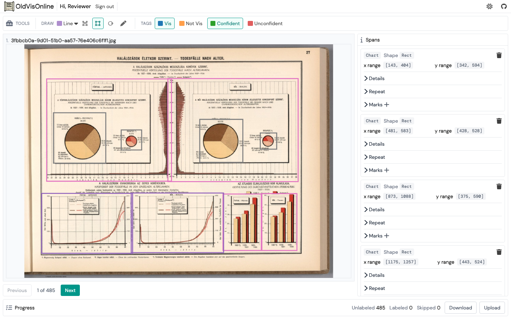

<p align="center">
  <a href="https://pnpm.io/"></a>
  <a href="https://vuejs.org/"></a>
  <a href="./LICENSE"></a>
</p>

# OldVis Image Segmentation Labeler

A web app for labeling old charts and figures. Draw boxes and shapes on an image, fill in chart details, and add tags. Everything is saved in your browser — no server database needed.

[Live demo](https://oldvis.github.io/image-segmentation-labeler/)

## Features

- **Drawing tools**: draw boxes, polygons, and points on the image
- **Chart details**: set title, theme, marks, and related fields for each drawn region
- **Tags**: label the current image (for example Vis / Not Vis, and confidence)
- **Saved locally**: work is kept in the browser; download or upload labels as a JSON file
- **Progress**: see how many images are unlabeled / labeled / skipped, and move through them one by one

## See It In Action

Tools, image, region list, tags, and progress sit in one screen.



## Start Using It

### Try the live demo

Open the hosted app:

[https://oldvis.github.io/image-segmentation-labeler/](https://oldvis.github.io/image-segmentation-labeler/)

### Run locally

```bash
pnpm install
pnpm dev
```

## How Labeling Works

1. Open the app (sample images load automatically).
2. Draw a box, polygon, or point on the image, or set tags for the image.
3. Click a region in the list to edit its chart details.
4. Click **Next** to mark the current image as labeled and go to the next one.
5. Download your labels as JSON, or upload a JSON file to load labels.

## For Developers

| Command | Description |
|---------|-------------|
| `pnpm install` | Install dependencies |
| `pnpm dev` | Start the local app |
| `pnpm build` | Build for production |
| `pnpm lint` | Run ESLint |
| `pnpm typecheck` | Check TypeScript types |
| `pnpm test` | Run unit tests |
| `pnpm test:e2e` | Run end-to-end tests |
| `pnpm docs:screenshot` | Update `docs/images/screenshot.png` for this README |

You will need:

- [Node.js](https://nodejs.org)
- [pnpm](https://pnpm.io/)
- Playwright browsers for e2e / screenshots (`pnpm exec playwright install` if needed)

This project started from the [vitesse-lite](https://github.com/antfu-collective/vitesse-lite) template.
